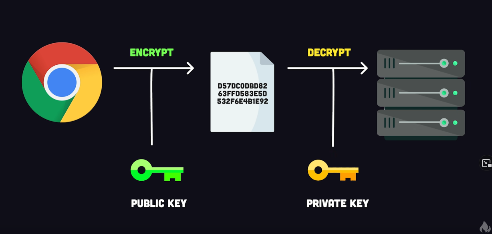

name: kevin wong\
file: readme.md\
date: 1/8/2022\
desc: Notes on a cryptography video from FireShip

## Caesar cipher
* Shifting letters of alphabet by one or more letters before passing a message 
* shifting letters of alphabet by one letter to the right
* ```abcdef..``` => ```bcdefg..```

## Obsolete ciphers
* cryptography will always be evolving as computers get more powerful.
* algorithms used to encrypt passwords(or sensitive information) will be easier and easier to crack by brute force as computing power increases over time

## Hash("to chop and mix")
* ```password``` => ```hashing function``` => ```fixed length value```
* the hashing function has to always produce the same output given the same input
* has to be fast to compute and unique
* extremely difficult for a computer to reverse the hash function
* some examples are md5, sha, and argon2
* MD5 is an example of a hashing algorithm that is now obsolete

## Salt
* a random value added to the password before it's hashed
* alot of times humans use a common password like "123" compromising the encryption
* ```password``` + ```salt``` => ```hashing function``` => ```fixed length value```
* makes it so users that use the same password have different hashing algorithm outputs

## HMAC
* ```password``` => ```password(or token)``` => ```hashing function``` => ```fixed length value```

## Symmetric Encryption
* ```message``` => ```cipher``` => ```cipher text```
* only person with a ```shared key``` can decrypt the cipher text
* the cipher can be randomized so that two same messages can have different cipher text
   * Symmetric
      * both sender and reciever will need the same password
      * but it isn't common for sender and reciever to agree upon a shared password
   * Keypairs
      * Public key and a private key
      * Like a mail box, anyone with a public key can deposit mail, but only the person with the private key can take the mail out
   * Asymmetric Encryption
      * 
      * for example a https(hyper text transfer protocol) A website will send your encrypted information along with a public key to a server. The remote server will then decrypt the information using a private key.

## Signing
* digital signatures
* using private key to sign a hash
* public key can then decrypt the hash using their public key to ensure/verify it came from the correct private key
